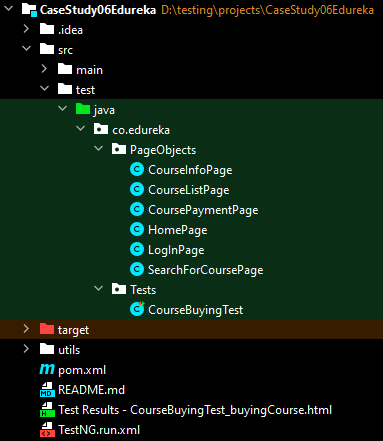

### Project Overview

This project implements a hybrid Test framework for automating the process of logging in to the Edureka portal, selecting a course, checking out with valid address details, and canceling the selected product at the end of payment.

### Automation Steps

1. **Login to the Edureka portal:** Login using valid credentials.
2. **Search for Selenium courses:** Search for Selenium courses on the portal.
3. **Select course:** Open the page of the first course found.
4. **Enroll in the course:** Enroll into the selected course.
5. **Proceed to payment:** Navigate to the payment window.
6. **Validate the test case:** Validate the test case by comparing the actual page title with the expected page title.

### Project Structure

### Implementation Details

- **Page Object Model (POM):** The project adheres to the Page Object Model, with separate classes for each page of the application (Home Page, Login Page, Course List Page, Course Info Page, Course Payment Page, Search for Course Page).
- **Hybrid Testing Framework:** The test script `CourseBuyingTest.java` implements a hybrid testing framework by reading test steps and keywords from the `KeyWords.xlsx` file. It utilizes Apache POI for reading Excel files and performs actions based on the keywords specified in each row of the Excel sheet.

### Dependencies

- Selenium WebDriver
- TestNG
- Apache POI

### Execution

To execute the test script, run the `CourseBuyingTest.java` class. Ensure that the WebDriver executable is properly configured and the `KeyWords.xlsx` file is available in the `utils` folder.

### Note

- Update the WebDriver instantiation in the test script with the appropriate WebDriver executable path for your system.
- Modify the login credentials and any other test data as per your requirements.

### Contributors

- Lakshya Kumar Sirohi

Feel free to reach out for any further assistance or inquiries! Happy testing!

